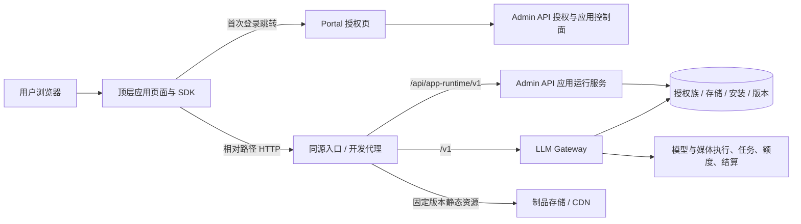
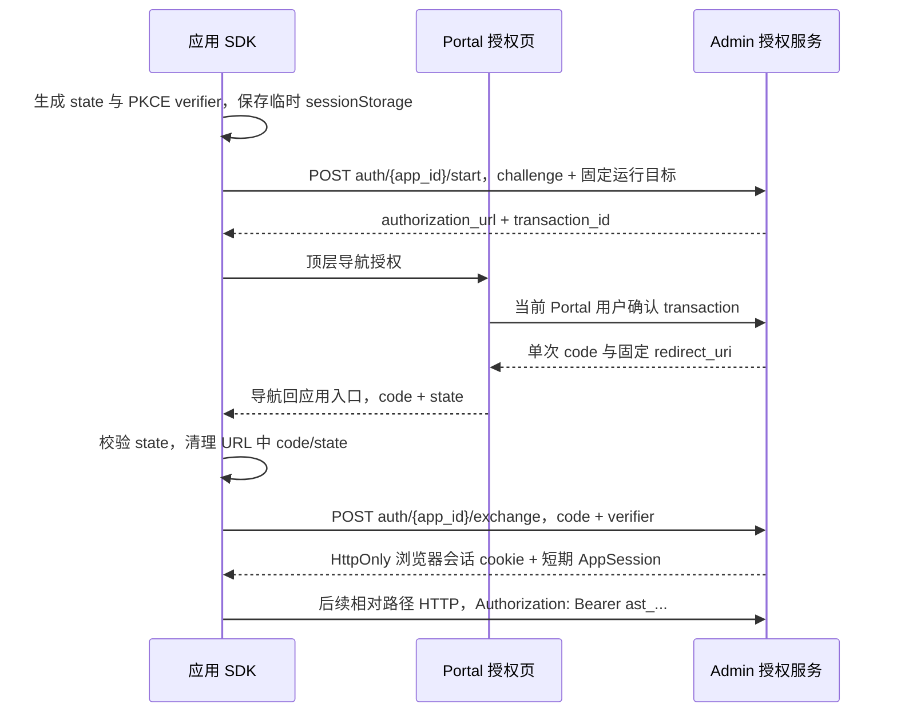

# 应用 HTTP Runtime 设计

日期：2026-09-08。状态：目标设计，已分阶段实施本地 HTTP 传输。本文描述完整目标，不代表所有接口已上线。

实施进展：SDK/CLI 本地默认请求 `/v1`、`/api/app-runtime/v1`；Admin 新增 profile/capabilities/preferences/storage/session HTTP 接口，Admin 与 Gateway 共用 AppSession 验证，按需签发 v2 audience token。旧登录 handoff、生产 iframe、last-write-wins 存储、app/user 共用数据空间仍保留。PKCE/browser session、page 制品入口、CAS、操作恢复索引和 dev/preview 隔离待实施；当前实际契约以 [API_REFERENCE.md](API_REFERENCE.md) 为准。

## 1. 决策与范围

受信任的自有应用以平台域名下的顶层页面运行，使用相对路径 HTTP 调用平台。生产应用不再依赖 AppHost、iframe、`window.parent`、握手或运行时 `postMessage`。开发使用同一套 SDK 和 HTTP 协议，通过本地代理连接真实平台。

移除的是页面宿主依赖；保留 App Session，作为当前用户、应用、运行版本、权限与计费身份。应用不持有供应商密钥、Portal 登录令牌，也不需要自建模型后端。`design` 的试穿、商品套图、详情页、复刻等模块统一使用这一运行面。

| 决策 | 定案 |
| --- | --- |
| 自有应用入口 | `https://平台域名/apps/{app_id}/`，解析到固定版本顶层页面 |
| 模型与媒体 | 同源 `/v1/*`，继续由 Gateway 路由、限额、执行和结算 |
| 应用数据 | 同源 `/api/app-runtime/v1/*`，由 Admin API 提供独立 AppSession 鉴权入口 |
| 初次认证 | 平台授权页 + 一次性 authorization code + PKCE S256 |
| 续期 | 服务端可撤销浏览器会话，HttpOnly cookie；短期 `ast_` 仅在浏览器内存 |
| 本地开发 | CLI + Vite/HMR + loopback HTTP 代理，浏览器请求路径与线上一致 |
| 第三方应用 | 每应用独立来源，也使用顶层页面与 HTTP；不放到 Portal 来源执行 |
| 老包 | 按发布记录继续 AppHost/Bridge，逐应用重打包迁移 |

“同域”在这里要求协议、主机、端口都相同。`localhost:5176` 与 `localhost:9003`、`www.example.com` 与 `api.example.com` 都不同源。路径不构成权限或脚本隔离边界。

## 2. 设计前现状核查

| 已有实现 | 差距与依据 |
| --- | --- |
| `/apps/:id` 独立入口 | `portal/src/pages/apps/StandaloneApp.tsx` 仍返回 `AppHost`；当前 iframe sandbox 未设置 `allow-same-origin`，资源 URL 相同也不能视为同源页面 |
| SDK `direct` | `app/proxy-app-sdk/src/index.ts` 由调用方注入 AppSession/refresh 回调；storage、profile、capabilities 等直接调用 `/api/app-runtime/v1` |
| 模型 HTTP | 已有 `ast_` + `/v1`，可复用 Gateway 的模型、任务、计费系统 |
| 用户与存储 API | `admin-api-go/pkg/router/router.go` 只有 Portal 登录鉴权的 bridge/sessions 等入口，没有本文定义的 App HTTP 服务和 App OAuth 流程 |
| 本地登录 | `app/cli/local-dev-relay.mjs` 经表单接收 Portal access token 并存在 Relay 内存，不是 authorization code + PKCE |
| 会话版本 | `appmarket/service.go` 创建会话会更新 installation.version；Gateway 要求安装版本与 token 版本相等，开发/预览可能影响生产会话 |
| JWT 校验 | 当前 audience 固定为单值 `proxy-llm-gateway`；Admin Runtime 不能直接接受旧 token |
| 存储 | `(app_id,user_id,key)`，更新会递增 revision，但未暴露条件写入；删除后重建会重置记录，不能解决多标签冲突 |
| 静态部署 | 包可能直接使用公共 COS/CDN URL；`portal/nginx.conf` 的 `/apps/*` 回退到 app.html；Portal Vite 只特殊处理单层入口 |
| 同源网关 | `deploy/prod/ingress.yaml`、`deploy/pre/ingress.yaml` 的 Portal 域目前没有 `/v1` 转发；Portal Vite 也只有 `/api` 代理 |
| Manifest | 服务端与 CLI 当前强制 `runtime.type=iframe`，不能只改网页跳转就迁移旧包 |

关联现行契约：[API_REFERENCE.md](API_REFERENCE.md)、[APP_API_OPENING.md](APP_API_OPENING.md)、[APP_MARKET.md](APP_MARKET.md)。实施完成前，这些文档仍描述旧协议；本文是新增协议的设计依据。

## 3. 服务与请求路径



`/api/portal/*` 继续服务平台管理页面和 CLI，不对 AppSession 开放。`/api/app-runtime/v1/*` 是另一套面向应用的窄接口，虽可由同一 Admin API 进程实现，但使用独立中间件。浏览器只知道外部相对路径，内部 `9003/9002` 地址由部署路由处理。

`shared` 提供 token/principal 契约及验证逻辑，Admin 和 Gateway 分别适配仓储。禁止 Admin 直接导入 Gateway 业务服务，也不复制两份有差异的权限判断。

### 环境矩阵

| 环境 | 浏览器来源及资源 | HTTP 上游 | 身份与数据 |
| --- | --- | --- | --- |
| 本地全栈 | `http://127.0.0.1:5176`，Vite 源码与 HMR | `/api/app-runtime/v1` 到本地 Admin；`/v1` 到本地 Gateway | 本地平台账号，development workspace |
| 本地连接预发/线上 | 同一 Vite 页面 | 两个相对路径由开发代理转至指定平台 HTTPS 入口 | 目标平台真实用户，development workspace，真实模型计费 |
| 预发发布包 | 预发平台固定版本 URL | 同源入口到预发 Admin/Gateway | 预发用户、数据库和制品 |
| 生产自有应用 | Portal 域下固定版本 URL | 同源入口到生产 Admin/Gateway | 当前运行用户，production namespace |
| 私有预览 | 受保护的 preview URL | 同源 HTTP | owner/获准测试者、精确制品、preview namespace |
| 第三方发布包 | 每 app 独立来源 | 该来源的 `/api/app-runtime/v1` 和 `/v1` 边缘转发 | 同一平台用户，权限仅限该 app |

开发选择平台是显式 CLI 配置；线上不读 localhost 默认值。开发不会模拟模型成功，也不会自动回退到应用拥有者的计费身份。

## 4. 页面、制品与运行配置

### 4.1 入口与固定版本

1. `/apps/{app_id}/` 是不缓存的启动解析入口。服务端按应用信任级别和已发布版本选择来源、`version_id` 与 `artifact_sha256`。
2. 自有应用重定向到 `/apps/{app_id}/versions/{version_id}/index.html`，直接返回应用 HTML。第三方重定向到分配给该 app 的来源。页面内不再嵌套 iframe。
3. 版本资源路径不可覆盖；制品由受控存储读取或由同源边缘代理 CDN 提供。HTML 每次经过应用/版本禁用检查并使用 `Cache-Control: no-store`，禁止标记为 `immutable`；固定 JS/CSS/图片可长期缓存。不能将自有应用入口再次重定向到另一个 CDN 来源，然后声称相对 API 仍指向平台。
4. 第一版 page runtime 统一使用 hash 路由；版本目录下不存在的文件返回 404，不任意回退 HTML。后续支持 history 路由时必须同时定义 route manifest 和固定 asset base。
5. `/apps/{app_id}/preview/{grant_id}/...` 单独处理，先验证短期预览访问凭据，再读取固定制品；`private,no-store`、`Referrer-Policy: no-referrer`。预览凭据不赋予模型权限，仍需 App 授权。

静态公开页面可被未登录用户加载；安装、购买、运行权限在授权与每次业务请求时校验。不能以静态 URL 保密替代授权。私有草稿需进入私有存储/访问策略，发布路径不得兜底读取草稿；当前已公开的草稿资源不能仅靠新路由宣称变为私有。

新增 `proxy.app/v2`，示例目标 manifest：

```json
{
  "schema": "proxy.app/v2",
  "id": "app.proxy.example",
  "version": "0.3.0",
  "runtime": { "type": "page", "protocol": 2, "entry": "index.html", "routing": "hash" },
  "permissions": ["storage.user"],
  "apis": ["model.images", "model.responses"],
  "backend": { "type": "platform" }
}
```

这里仅展示运行相关字段；名称和收费等仍按发布契约校验。第一版 v2 强制 `runtime.entry=index.html`，且文件必须位于版本根目录；上传校验拒绝其他 entry、目录层级或同名替代入口，SDK 可从该目录可靠定位 runtime.json。受信任来源资格由平台控制面设置并审计，不能由 manifest 自行声明。v1 iframe 包与 v2 page 包分别校验，不能静默转换已有 ZIP。

### 4.2 公开运行配置

SDK 从版本根目录的 `runtime.json` 读取配置；开发由 Vite 插件提供同名端点。该路径是平台保留资源，构建校验和服务端上传校验都拒绝 ZIP 内同名文件；请求必须先命中精确的动态 runtime handler，再考虑版本静态或 CDN 路由，不能由制品内文件或通用静态回退提供。配置在制品摘要之外，使同一份包可进入不同环境。响应为 `no-store`，包含：

```json
{
  "protocol": 2,
  "app_id": "platform-generated-id",
  "version_id": "immutable-version-id",
  "artifact_sha256": "sha256-of-artifact",
  "environment": "production",
  "app_base_path": "/apps/platform-generated-id/versions/immutable-version-id/",
  "runtime_base_path": "/api/app-runtime/v1",
  "auth_base_path": "/api/app-runtime/v1/auth/platform-generated-id",
  "gateway_base_path": "/v1",
  "authorization_url": "/app-authorize"
}
```

该响应不是会话，不包含 token 或用户数据。服务器验证其中对应的应用/版本关系；客户端提供同名字段不构成授权。开发配置改用 `dev_run_id` 与 `manifest_digest`，没有虚构的发布制品摘要。

支持平台部署在路径前缀下：上述 base path 由部署配置统一产生，例如 `/public/v1`。线上 SDK 拒绝跨源业务 base path；授权 URL 可为受控平台的绝对地址。不要用宿主探测、hostname 或端口猜运行协议。

## 5. 登录、会话与安全边界

### 5.1 首次登录：统一授权码流程

本设计不依赖尚不存在的 Portal cookie 登录改造。Portal 授权页沿用平台自己的登录实现，只有该页面使用 Portal 凭据；应用、SDK、开发代理不会读取或接收 Portal JWT。



`start` 不需要登录，但仅接受注册的 app、运行目标和回调。授权码有效 60 秒、单次使用，绑定用户、授权事务、app、固定制品或 dev run、scopes、PKCE S256 和完整 redirect URI。交换时重新核验安装、购买、版本与撤权状态；不能仅凭 app_id 签发令牌。授权事务最多 10 分钟，服务器限制创建速率。

回调必须精确匹配平台记录，不接受通配来源、任意 return URL 或开放重定向。生产回调为固定版本入口；本地回调为本次 dev run 注册的 loopback 协议、主机、端口及路径。SDK 仅将 verifier/state/事务和恢复路由短期放入 sessionStorage，按 issuer/app/state 分组并绑定运行目标，用完删除；不在 URL、localStorage 或日志保存 token。所有授权错误同样校验 state。授权回调 HTML 和认证响应均使用 no-store/no-referrer；SDK 回调代码先于分析脚本或外部资源运行，及时清理参数，访问日志不记录 code/state/verifier。

code 仅存 hash；exchange 在服务端事务中消费 code 并建立授权族。交换响应丢失时，浏览器若已收到 cookie 则 refresh 恢复，否则重新授权，不能卡在已消费 code 的无限重试中。

首次未安装/缺权限时在 Portal 完成安装、购买或授权。已经登录且已授权时可直接返回 code。默认使用顶层导航，不依赖弹窗、opener 或 postMessage；不会因浏览器禁止弹窗阻断运行。

### 5.2 续期与退出

采用服务端浏览器会话，而不是把 OAuth refresh token 交给应用：

- 交换成功设置随机、不可预测的 opaque session handle cookie；数据库仅存 handle hash，绑定 user、app、environment、授权族及平台登录 session。
- 生产 cookie 为 `HttpOnly; Secure; SameSite=Lax`、host-only，不设置 `Domain`；名称按 app 区分，Path 限定 `/api/app-runtime/v1/auth/{app_id}/`，并尊重部署前缀。cookie Path 只减少携带范围，不作为同源应用隔离。
- production、preview、development 的 cookie/family 分开。后两者使用 `/api/app-runtime/v1/auth/{app_id}/runs/{run_id}/`，cookie 名同时包含 run 标识；`auth_base_path` 指向对应路径，所有 start/exchange/context/refresh/logout 操作语义相同。生产一个 app 的标签可共享授权族，不同预览 run 不能覆盖生产会话。
- 默认闲置 7 天、绝对 30 天到期，可由平台缩短。登录/切换身份更换 handle；`refresh` 根据服务端授权族续发 15 分钟 `ast_`。明确这是可撤销 BFF session，不声称浏览器 refresh token 每次旋转。
- SDK 在内存缓存 access token，临近到期时 single-flight 刷新。硬刷新从 HttpOnly session 恢复；失效则重新顶层授权。服务端按授权族和固定运行目标串行合并续发，避免多标签重复创建会话、互相挤占现有“最多 5 个会话”限额。
- 限额改按活跃浏览器授权族计算；续发不逐次占用新名额。旧 access token 允许自然过期，不因正常续发立即撤销，避免已发请求和 SSE 被误杀；撤权、卸载、禁用和退出则撤销整族。
- 所有 cookie 鉴权的认证 POST 使用 JSON、自定义 CSRF header，并严格验证 Origin/已注册开发来源；`GET auth/{app_id}/context` 返回 no-store 的 CSRF token，绑定浏览器会话。没有会话时 exchange 依靠 state/PKCE/事务绑定，并仍做 Origin 校验。
- `logout` 撤销当前浏览器授权族并清 cookie。Portal 新增可撤销登录 session：登录创建 `sid`、JWT 续期继承 sid、授权签发与 code 交换均验证 sid；平台退出先撤销 sid 及关联 App families，再清 Portal 本地状态。旧无 sid 的 Portal JWT 在 v2 授权入口要求重新登录，不能无限换取新授权。当前仅清 localStorage 的退出不足以完成此契约。
- 不依赖 `beforeunload` 撤销；切账号通过新登录记录和服务端撤销校验隔离。SDK 清内存缓存并通知同源标签重读身份；跨来源正确性由服务端校验保证。

稳定 cookie 被窃取仍可在其有效期内使用，因此必须限制有效期、服务端撤销、禁止日志记录并使用 TLS。HttpOnly 不能防止同源恶意 JS 代用户发请求。

### 5.3 AppSession v2

保留 `ast_` 前缀，新增 `token_version=2`。audience 明确为 `['proxy-llm-gateway','proxy-app-runtime']`；服务端校验自己的目标 audience，不放宽为“任意有效 JWT”。先升级 verifier，再签发新 token；旧 token 仍只允许现有 Gateway 路由。

principal 包含 `user_id/app_id/app_version/version_id/artifact_sha256/installation_id/environment/workspace_id/grant_id/jti/scopes`；development 用 `dev_run_id/manifest_digest`，preview 绑定独立 preview grant。收费快照继续仅存在服务端，不进入浏览器 token。

每次业务请求校验签名算法、issuer、audience、expiry、JTI 与授权族状态、真实用户、应用禁用状态及运行许可。生产需要有效安装和购买；开发/预览使用单独授权记录，不伪造或覆盖 production installation。DB/撤销状态不可用时拒绝执行付费操作，不降级为仅验签。

有效权限分别计算：公共权限为 token scopes、安装/授权 grants、固定 manifest.permissions 的交集；模型权限为 token scopes 与固定审核 manifest.apis 派生权限的交集。开发未审核版本仅允许获准开发用户和受限 dev grant。版本 header 只校验一致性，body/query 中的 user_id/app_id 不能改变 principal。

### 5.4 信任级别

自有 app 与 Portal 同源等于接受相同脚本信任边界。无论 AppSession、HttpOnly、CSP、应用路径怎样设计，都不能隔离同源恶意 JS。第三方必须使用每 app 独立来源，建议独立可注册域下的应用子域；不共享 Portal Domain cookie、localStorage 或 Service Worker 范围。

第三方域的边缘只开放固定制品、auth/runtime API 和允许的 `/v1` 路由，不转发 `/api/portal/*`。来源到 app 的映射由平台管理并交叉校验 token；清理浏览器可伪造的内部转发头。CORS 只决定浏览器响应可读性，不能代替 token、安装和 scope 校验。

## 6. HTTP 与 SDK 契约

以下均为新增目标端点，前缀为 `/api/app-runtime/v1`：

| 方法与路径 | 授权及语义 |
| --- | --- |
| `POST /auth/{app_id}/start` | 验证公开运行目标，创建授权事务，不签发 access token |
| `POST /auth/{app_id}/exchange` | 一次性 code + verifier；设置浏览器会话并返回 AppSession |
| `GET /auth/{app_id}/context` | cookie 会话状态、CSRF token；不返回 access token |
| `POST /auth/{app_id}/refresh` | cookie + CSRF + 固定运行目标；重验授权，返回 AppSession |
| `POST /auth/{app_id}/logout` | cookie + CSRF；撤销当前授权族，清 cookie |
| `GET /session` | ast；当前用户标识、运行目标、过期时间、有效权限 |
| `GET /profile` | ast + `user.profile.read`；白名单字段，默认不返回邮箱 |
| `GET /capabilities` | ast；实际允许的 API、存储限额、浏览器本地能力标记 |
| `GET /preferences` | ast + 对应已授权的 theme/locale 权限；缺失时客户端采用系统偏好 |
| `GET /storage/items?key=...` | ast + `storage.user`；存在标志、value、opaque ETag |
| `GET /storage/items?prefix=...&cursor=...&limit=...` | 同上；稳定分页，limit 上限 100；与 key 查询互斥 |
| `PUT /storage/items?key=...` | 同上；条件写入 + 幂等键 |
| `DELETE /storage/items?key=...` | 同上；条件删除 + 幂等键 |

auth 路径中的 app_id 只是会话路由，必须与事务/cookie/grant 匹配。业务端点从 ast 派生 app_id 和 user_id。Portal 的授权确认另挂在其登录保护路由，例如 `POST /api/portal/user/app-authorizations/{transaction_id}/approve`，不允许 ast 调用。

上表 auth 路径展示 production 形式；development/preview 在相同 auth_base_path 下使用相同操作，按上一节增加 run 隔离。Edge 从受控虚拟主机取得实际来源/app 映射并覆盖外部转发头，不能直接相信客户端 `X-Forwarded-Host`。auth 的 POST 严格验证确切 Origin 和运行绑定；GET context 允许浏览器不发送 Origin，但必须验证同源 Fetch Metadata、受控 Host 和会话绑定，不对外开放跨源读取 CSRF token。开发代理转发并核验注册的 loopback 来源上下文；SameSite 不能替代这些检查。

Runtime JSON 成功使用 `{ "data": ..., "request_id": "..." }`，失败使用 `{ "error": { "code": "...", "message": "...", "retryable": false }, "request_id": "..." }`；HTTP 状态与错误一致。Gateway 保留已有 JSON/SSE/二进制格式，代理不得包裹改写响应。

Gateway 当前会把不同认证失败合并为 `credential_invalid`；实施时须在保持 envelope 兼容的同时，增加由平台认证层产生的稳定 `auth_reason` 和 `execution_started=false` 语义，区分过期、撤销与无权。该标记不能取自供应商响应，也不能仅凭客户端未收到首字节推断。下表认证 code 在 Runtime 直接返回，在 Gateway 通过对应 reason 映射；旧无 reason 的 401 不具备 v2 自动重放资格。

| HTTP / code | SDK 行为 |
| --- | --- |
| `401 APP_SESSION_EXPIRED` | 平台确认认证阶段拒绝且未执行、body 可重放时 single-flight refresh，最多重试一次 |
| `401 APP_LOGIN_REQUIRED` | 结束自动重试，进入登录状态 |
| `403 APP_NOT_INSTALLED / APP_PERMISSION_DENIED / APP_DISABLED` | 明确访问失败，不刷新循环 |
| `409 APP_VERSION_CHANGED` | 保留未提交输入，提示并重载启动入口，不用新会话继续跑旧包 |
| `412 STORAGE_CONFLICT` / `428 STORAGE_PRECONDITION_REQUIRED` | 重读并合并，禁止静默覆盖 |
| `413 PAYLOAD_TOO_LARGE` / `429` | 提示限额；429 遵守 Retry-After，付费操作须保持原幂等键 |
| `5xx` / 网络中断 | 区分服务失败和提交结果未知，不伪装成功，不统一显示 Bridge 超时 |

SDK v2 的 `createApp` 使用明确的 HTTP runtime 配置；`api.request/stream` 对相对 Gateway 路径调用 fetch，storage/profile 等映射到 Runtime HTTP。保留常用 SDK 方法名以减少业务迁移；generic `call()` 仅作为已知方法适配器，未知 Bridge 方法明确拒绝。

toast、下载、剪贴板、`matchMedia` 和浏览器 Notification 属于应用 UI/浏览器能力。toast 由应用渲染；系统通知需浏览器用户许可，不伪造 HTTP 通知接口。theme/locale 使用已有权限名并在 capabilities 中列明，不硬编码现有 Bridge 的 `system/en-US` 为平台实际偏好。

## 7. 存储与真实模型业务闭环

### 7.1 用户数据

存储 namespace 为 `(environment,workspace_id,app_id,user_id,key)`：production 使用固定 workspace，保持原 app/user 数据跨版本连续；development workspace 按开发绑定稳定，preview 按预览授权隔离。环境和 workspace 均由 grant 派生，不允许请求自行切换。`app_version` 不加入默认 key；数据格式使用业务 `schema_version` 管理升级。

- 保留 key 160 字符和单值 256 KiB 限额；新增每 app/user/workspace 默认 10 MiB、1000 个活动键的配额，并通过 capabilities 返回有效值。大图/二进制继续走平台媒体存储，不能塞 base64 到 KV。
- GET 返回 `exists`，区分不存在和 JSON null。存在记录带 opaque ETag；PUT 更新要求 `If-Match`，首次创建用 `If-None-Match: *`。DELETE 要求 `If-Match`；缺条件 428，冲突 412。
- 条件检查与写入在同一事务内完成；删除保留墓碑或使用永不复用的 ETag，避免删除重建后的 ABA。旧 Bridge 写入也必须经过同一 repository 更新版本，使新客户端能发现旧客户端的写入。
- SDK 提供返回元数据的 `getItem/setItem/deleteItem`。兼容 `get/set` 可记录读取时 ETag，set 使用该 ETag；未读过的 key 只尝试首次创建，不在 set 时偷偷读取最新值后覆盖。冲突交应用合并或明确提示。
- `Idempotency-Key` 按用户/app/environment/workspace/方法/资源隔离，原子保存完整请求指纹与结果，至少保留 24 小时。指纹包含 namespace、方法、key、body 及 If-Match/If-None-Match；鉴权后先查幂等结果，再做新的 CAS。同 key 同指纹重放原响应，不再次递增 ETag；异指纹返回 409。这样成功写入后响应丢失，旧 ETag 重试仍能取得原成功结果；412 后合并的新写入使用新幂等键。返回 replay_until，SDK 不在期限外自动重放未知结果的写入。
- 一份作品/会话一个文档，列表通过 prefix 分页取得，第一版不维护必须与详情同时提交的第二份索引。需要跨 key 原子性时另增有限事务接口，不能假设连续 PUT 原子提交。

历史数据迁移到 production 默认 workspace，不改变值或 app/user 所属。已有记录若超过新增总配额，允许读取/删除和不增加用量的更新，并记录待治理状态，不能上线即丢历史。墓碑与幂等记录有独立保留及清理策略，清理后也不复用 ETag。

### 7.2 生成任务、恢复与费用

一次完整业务必须包含：验证输入和权限、创建本地操作标识、持久化待提交记录、提交真实模型、保存任务身份、展示真实状态、持久化结果/失败、刷新恢复、下载，以及可关联的用量和结算记录。

`design` 的工作流文档保存模块、schema_version、规范化参数、请求摘要、步骤、稳定 operation key、task_id、状态、输入/结果引用及错误。图片内容保留于平台媒体资产，作品只保存受权限控制且可续取的 asset/task 引用；不能把临时签名 URL 当永久结果。尚未上传的浏览器 File/object URL 无法跨刷新恢复：这类待提交记录标记为“需重新选择素材”，核对摘要后才允许提交，不能宣称自动续跑。实现无损的未提交草稿恢复，需要先提供持久输入资产上传与引用；已经受理的任务依靠 Gateway 保存的输入和操作映射恢复。

任务、操作映射、计费幂等及产物访问统一按 `(user_id,app_id,environment,workspace_id)` 归属。operation key 在此范围跨模型路由唯一，路由与规范化请求摘要参与冲突检测；不能按 jti 或当前版本区分操作，否则续期/升级会重复执行。当前媒体幂等查询只有 user/app/key，实施必须补充环境/workspace，而不是仅扩展 token。旧无环境记录按历史兼容策略归入 production 默认 workspace；旧开发调用已与生产混存的事实不能追溯性伪装为已隔离。

1. 付费提交前生成稳定幂等键并持久化操作记录。保存失败时默认阻止提交，避免生成后无从恢复；Chat 可显式提供临时会话，但必须显示未同步状态。
2. Gateway 在接收任务时原子关联 principal、幂等键和 task_id。相同业务键重试不能创建第二个任务或重复结算；超时不是失败终态。
3. 保留现有 `/v1/images/tasks/{id}`、视频/音乐查询接口。为“服务端已接收、客户端未收到 task_id”补充 `GET /v1/operations/{idempotency_key}`，限定 ast principal，读取 Gateway 的操作映射，不新建另一套执行队列。新增 `platform.operations.read` 仅用于当前 app 自己的操作恢复。
4. operation 完整响应至少保留任务整个生命周期及结束后 7 天，返回 accepted/running/completed/failed、task_id、结果引用及 `replay_until/lookup_expires_at`。到期可清理大响应，但必须保留已受理操作的紧凑唯一记录和计费关联，禁止将同一已受理 key 重新视为新任务；过期重放返回 `410 OPERATION_EXPIRED`。浏览器重载先恢复映射和任务，不自动创建新的付费操作；lookup 404 也不证明从未提交，未知结果保持待核对。支持该契约的路由才声明可安全重放；仅发送幂等 header 不算实现幂等。
5. 同步文本/流式接口在接收内容后中断，保存 partial 状态，禁止透明重跑。仅平台鉴权层明确拒绝且未执行、请求 body 可重放时，才可刷新后用同一操作键重试。供应商 401、不可重放的上传流和执行状态未知的断连都不能触发透明重发。
6. 取消请求只停止浏览器等待；只有 Gateway 支持取消且确认成功时，才显示任务已取消。没有取消能力的图片任务继续查询终态，费用按实际执行策略结算。

KV 保存失败不把已完成的模型任务改成模型失败。刷新可从 operation/task 恢复后补存；账号切换必须清除前一个用户的本地缓存。付费模型幂等与任务身份绑定属于上线门槛，不假定现有所有路由已经满足。

### 7.3 应用状态

session、模型目录、历史读取、生成任务和历史写入分别维护状态。Chat 当前 `Promise.all(models, history)` 会让历史失败遮蔽可用模型；保存的 `.catch(() => undefined)` 会吞掉失败，迁移时都需修正。

历史读取失败可以显示空白占位和重试，但不得当作“云端本来为空”并写回空历史。模型失败时仍可查看既有作品；保存失败明确显示未同步。平台上游 403/超时必须保留真实失败与 request_id，不能用示例图片替代真实结果后报告成功。

## 8. 开发代理与部署要求

### 8.1 CLI / Vite

CLI 继续负责工程绑定、manifest 校验、Vite 启动、构建、打包、上传与审核提交。管理凭据仅用于这些控制面动作；`dev` 注册独立 dev run，记录 app、manifest digest、workspace、loopback origin 和精确回调，不改生产安装版本。

Vite 将 `/api/app-runtime/v1/*` 与 `/v1/*` 送到开发代理，再转到固定平台上游。SDK 与线上使用相同请求/响应。代理不做 Bridge RPC、模型调度、权限授予或计费，不把 Portal token 交回本地。

开发授权仍用浏览器 PKCE 回调到 Vite 入口。为兼容 HTTP loopback 的 cookie，代理仅截获 auth 端点的指定平台会话 cookie，在进程内按“随机本地 handle -> 远端浏览器 session”分别保存，禁止全进程共享一个用户 cookie。浏览器得到 HttpOnly、SameSite=Lax 的本地 handle；映射绑定 dev run、app、Host/Origin/port 并有到期时间。后续 auth 请求校验映射并带入对应远端 cookie，退出或进程正常关闭同时撤销，异常退出依靠服务端到期回收。远端 cookie、管理令牌均不进入 Vite client env、浏览器脚本或文件。代理重启后重新授权。

只有已注册 loopback HTTP 开发运行允许本地 cookie 无 Secure；线上和第三方入口一律 HTTPS。cookie 不按端口隔离，因此本地名称/Path 需包含 dev run 唯一标识，代理同时验证 Host/Origin/运行标识；开发机本身是同一信任环境。

代理仅监听 loopback，拒绝 DNS rebinding、任意 Host、任意上游 URL 和外部 Origin；Vite 到内部代理仍使用进程内 secret。转发认证时只允许绑定目标、绑定来源和指定 cookie，禁止通用 cookie 透传。业务 API 的 ast 仍由 SDK 设置，代理透明转发；所有内部身份头先移除。

旧 `/__platform/bridge` 仅随 v1 兼容路径保留，v2 不调用。HMR 不清除服务端会话或误撤销在途任务。开发/线上共用协议测试；单独运行未接代理的 Vite 应明确报告平台未配置。

### 8.2 边缘与服务配置

路由优先级：auth/runtime API、`/v1`、私有 preview、精确 `runtime.json` 动态 handler、固定版本静态资源、动态 `/apps/{id}/` 启动入口、最后才是 Portal SPA fallback。未知 API 返回 JSON 404；缺 JS/CSS 返回真实 404，不能是 HTML 200。

同时修改 Portal Vite、Portal nginx、prod/pre ingress 和相应路径前缀配置。Portal 主域新增 `/v1` 转发至 Gateway；独立 `api` 域可继续服务现有 API 用户。第三方域仅暴露上述应用专用路由。

| 内容 | 缓存/传输约束 |
| --- | --- |
| 启动解析、runtime.json、auth、用户数据 | `Cache-Control: no-store`，不得 CDN 缓存 Set-Cookie |
| 应用 HTML，包括固定版本入口与授权回调 | `no-store`，每次检查应用/版本禁用状态；回调另加 no-referrer |
| 含固定版本的公开 JS/CSS/图片 | 不含用户数据，可长期 immutable；CDN purge 不能撤销浏览器已缓存的代码 |
| 私有 preview | 每次验证访问凭据，`private,no-store`、no-referrer；不得落入公开缓存 |
| SSE | 禁用 response buffering/cache，首字节立即转发；传递取消，保留事件顺序，不包装响应 |
| multipart/二进制 | 流式透传，不读取整包再转发，不覆盖 boundary/Content-Type |
| 错误 | 保留 HTTP 状态、结构化 body、request_id、Retry-After；边缘拒绝也应有明确错误 |

默认统一上传上限 50 MiB，受能力目录中更小限额约束；存储单值仍 256 KiB。当前 Relay 16 MiB 与线上 50 MiB 不一致，必须统一且通过流式计数限制 chunked body。普通 Runtime 默认 15 秒请求预算；长流不套 Bridge 10 秒超时，代理空闲超时初始 300 秒，并按路由测试心跳/断流。长媒体任务优先提交后轮询，不靠无限 HTTP 等待。

保留 Authorization、请求追踪、Idempotency-Key、版本一致性和条件写入 headers，过滤 hop-by-hop 及可伪造内部头。跨源兼容阶段 CORS 仅放行已登记来源和必要 headers，暴露 ETag/request_id/Retry-After；不对 credentials 使用通配 `*`。

page runtime 默认 `frame-ancestors 'none'`、`object-src 'none'`、`base-uri 'self'`，connect-src 限于同源和明确的平台媒体能力来源。禁止应用注册可覆盖 Portal 的 Service Worker，清理扩大作用域的响应头。发布校验需检查固定资源 base、第三方脚本依赖和 CSP 兼容性。

已经打开的页面不能靠 CDN 清缓存强制停止执行。撤销授权由服务端拒绝后续请求保证；移除页面入口和清 CDN 缓存只是补充措施。

## 9. 发布、升级与回滚

发布记录新增 protocol、运行类型、trust tier 引用、制品摘要与固定版本 ID；可变源码只存在 dev run。安装授权、会话声明、静态制品和收费快照必须指向同一运行目标。

生产采用明确更新策略：新启动解析当前已发布版本；旧标签在升级后收到 `APP_VERSION_CHANGED`，先保留未提交输入再重载。已受理的媒体任务可继续以原版本快照执行和结算；授权未被撤销的当前用户可从新版本查询同 app 的历史任务，不必保留旧版本 token。普通轮换不会取消已经开始的流。

dev run 与 preview grant 独立建模，不能通过更新 installation.version 来运行测试版本。开发声明权限改变时更新 manifest digest 并重新授权；HMR 的纯代码变化不伪称不可变发布版本。

回滚新增显式控制面操作：将发布指针切换到历史已审核且未禁用制品，记录操作者、原因和目标摘要；不能复用当前拒绝降版本的审核路径当作已有回滚。旧标签按相同版本更新策略重载。业务 schema 升级须兼容回滚目标，或明确阻止该版本回滚；不得为回滚删除用户作品。

## 10. 实施顺序与影响文件

| 阶段 | 工作及主要位置 | 完成门槛 |
| --- | --- | --- |
| P0：兼容修复 | `proxy-app-sdk/src/index.ts`、`portal/src/components/apps/AppHost.tsx`、`app/apps/chat/src/main.tsx` | 修复 SDK 丢弃无 value 错误响应；AppHost 错误加 `value:null` 兼容旧包；刷新 effect 不丢在途回包；拆开模型/历史状态与保存失败提示 |
| P1：鉴权与数据 | `shared`、`admin-api-go/pkg/module/appmarket`、router、Gateway auth | 新授权事务、browser families、dev/preview grants；audience v2；HTTP Runtime、CAS/幂等；Portal 服务端退出；两个服务验证一致 |
| P2：入口与部署 | manifest 校验、资源 handler、`portal/vite.config.ts`、`portal/nginx.conf`、`deploy/{pre,prod}/ingress.yaml` | page 制品与固定版本入口可直开，主域 `/v1` 生效，preview、缓存和静态 404 正确 |
| P3：SDK 与开发 | `app/proxy-app-sdk/src/{index,types,vite}.ts`、`app/cli/{proxy-app,local-dev-relay}.mjs` | HTTP login/refresh/storage 可用；开发仅留 HTTP/认证适配，protocol 显式选择，无 Portal token handoff |
| P4：应用业务 | `app/apps/{design,chat,...}`、Gateway operation/幂等、`API_REFERENCE.md` 等 | 作品与任务恢复、真实文本/图像调用、费用关联通过；新 SDK 打入递增版本 ZIP 并审核发布 |
| P5：灰度与退旧 | 按 app/version 的 runtime 记录、监控与回滚开关 | 自有应用逐个切 page；第三方隔离入口验收后开放；旧协议实际使用量归零并完成通知后退出 Bridge |

数据库变更先加字段/表与旧协议兼容仓储，再部署双读/双验证服务，最后切写入与发 token。production namespace 回填和旧唯一索引替换应有在线迁移与回滚脚本；不要一次删除旧列或 Bridge 路由。

SDK 被打入不可变应用 bundle。只更新仓库 SDK 不会修好已发布 ZIP；每个新包都要构建、校验、递增版本、上传与审核。发布开关按版本记录选择 v1/v2，不能看到同源就把老包当新协议执行。

## 11. 验收与可观测性

| 维度 | 必须通过的场景 |
| --- | --- |
| 运行位置 | 本地连本地、本地连预发、固定发布包、私有预览、第三方隔离入口、v1 旧包 |
| 无宿主 | 应用顶层直开、复制 URL 新标签、硬刷新、后退、HMR；v2 无 iframe/Bridge 请求，网络只有授权和 HTTP API |
| 身份 | 未登录、已有登录、code 重用/过期/错误 verifier、回调不匹配、刷新恢复、并发续期、切账号、平台退出、应用退出 |
| 权限 | 跨用户/app/workspace、错误 audience、过期/撤销 JTI、卸载、购买失效、撤权、禁用、非 owner 读草稿全部拒绝 |
| 版本 | app/manifest/token/hash 一致；开发与预览不影响生产；升级旧标签重载；回滚已审核制品且数据可读 |
| 存储 | 缺失与 null、多标签 CAS、旧 Bridge 写入后的冲突、删除重建、超限、重试不重复写、断网恢复、历史失败不回写空值 |
| 文本 | 真实模型 JSON 与 SSE、401 单次续期、首字节后中断、不透明重跑、历史失败仍能加载目录 |
| 媒体 | 真实图像提交/轮询/产物下载；创建响应丢失按操作键恢复；刷新/新标签恢复；同键不重复任务/扣费；不支持取消时如实显示 |
| 部署 | www/pre 的 `/v1`、路径前缀、SSE 不缓冲、multipart 限额一致、取消传播、API/缺失资源不返回 Portal HTML |
| 凭据 | 浏览器不接收 Portal JWT/provider key，code/token 不进日志或 localStorage，auth cookie 只到正确路径与目标 |
| 兼容 | 旧 ZIP 的真实错误及时显示；Host 正常续期不丢回包；v1/v2 可并行运行与分别回滚 |

请求日志使用独立 `request_id` 和稳定业务 `operation_id/Idempotency-Key`，记录 app/version/environment、授权失败类型、延迟、上游状态及 task_id；不得记录 token、cookie、用户存储正文和完整提示词。审计与模型用量可追溯到实际运行用户和固定收费快照。

监控至少覆盖授权成功率、refresh 失败/合并率、版本冲突、存储失败/CAS 冲突、SSE 首字节及中断、任务恢复率、重复操作拦截与 Bridge 版本使用量。协议测试可使用确定性测试服务；发布验收必须另有真实账户完成一次文本和图像闭环，并核对作品恢复与用量。上游拒绝或没有可用供应商时记录为未通过，不能用 HTTP 200 页面或示例输出代替验收。

## 12. 本次交付边界

初次交付完成代码现状分析、目标架构与验收矩阵。后续优化已实现页首注明的本地 HTTP 传输及基础资源接口，尚未部署或完成整套架构迁移。必须按实际验收区分传输改造、登录改造、发布迁移和付费模型闭环，不能因本地测试通过就宣称全部已上线。
